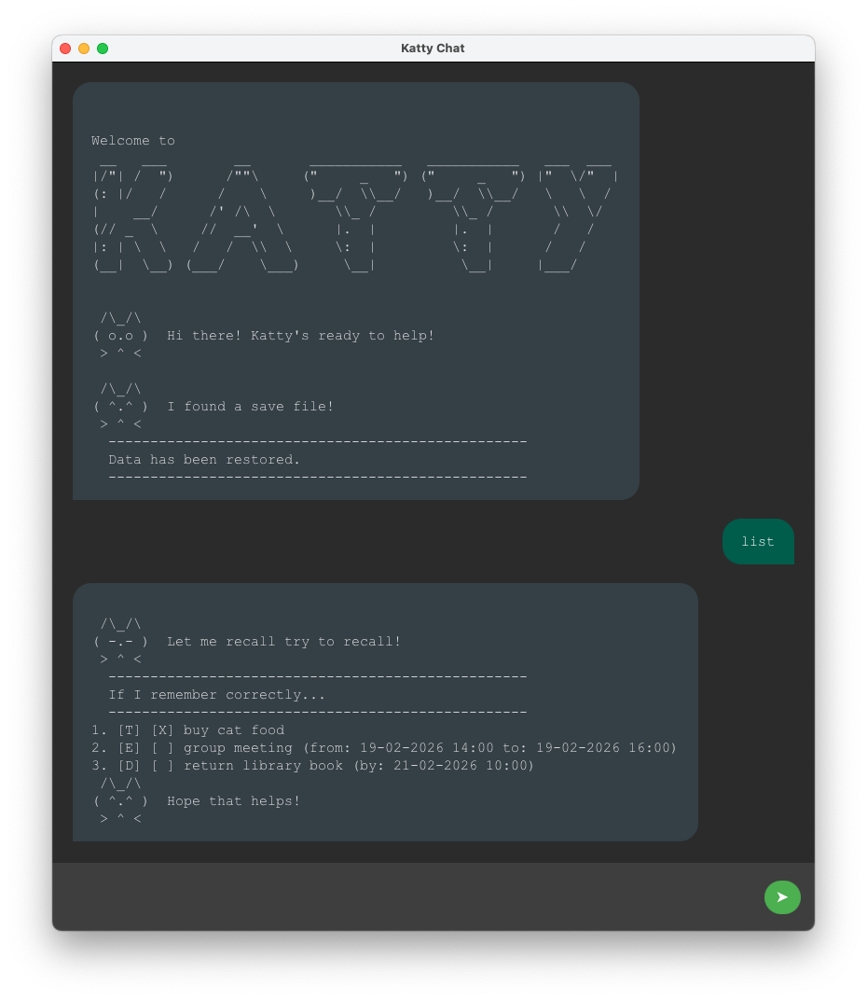

# Katty User Guide

**Katty** is an authentic, slightly witty, feline-inspired task management assistant.
She combines the speed of a Command Line Interface (CLI) with a modern, text-message-style GUI to help you stay organized without the fuss and with all the feline fun!

## Command Summary

| Action              | Format                                           |
|:--------------------|:-------------------------------------------------|
| **Add ToDo**        | `todo [description]`                             |
| **Add Deadline**    | `deadline [desc] /by [dd-MM-yyyy HH:mm]`         |
| **Add Event**       | `event [desc] /from [date time] /to [date time]` |
| **List All**        | `list`                                           |
| **Sort A-Z**        | `listByName`                                     |
| **Find**            | `find [keyword]`                                 |
| **Mark Complete**   | `mark [index]`                                   |
| **Mark Incomplete** | `unmark [index]`                                 |
| **Delete**          | `delete [index]`                                 |
| **Exit**            | `bye`                                            |

## Adding Tasks

---
Adding a task to Katty is as simple as typing a command into the chat box. Katty uses specific "keywords" to understand what kind of task you are creating. Once a task is added, Katty automatically sorts it by date (if applicable) and saves it to your local storage.
## Task Types

Katty categorizes your tasks into three types to help you distinguish between simple chores and time-sensitive commitments.

### 1. ToDos
ToDos are basic tasks without any date or time constraints. Use these for general items you need to keep on your radar.
* **Command:** `todo [description]`
* **Example:** `todo buy cat food`
* **Output:** `[T][ ] buy cat food`

### 2. Deadlines
Deadlines are tasks that must be completed by a specific date and time.
* **Command:** `deadline [description] /by [dd-MM-yyyy HH:mm]`
* **Example:** `deadline submit report /by 20-02-2026 23:59`
* **Output:** `[D][ ] submit report (by: 20-02-2026 23:59)`

### 3. Events
Events are tasks that occur over a specific duration, requiring both a start and an end time.
* **Command:** `event [description] /from [dd-MM-yyyy HH:mm] /to [dd-MM-yyyy HH:mm]`
* **Example:** `event project meeting /from 19-02-2026 14:00 /to 19-02-2026 16:00`
* **Output:** `[E][ ] project meeting (from: 19-02-2026 14:00 to: 19-02-2026 16:00)`

---

## Features

Katty provides several ways to organize and interact with your task list to keep your workflow smooth.

### Viewing Your List
You can view all your tasks at any time. By default, Katty shows them in the order they were added or by date.
* **Command:** `list`
* **Outcome:** Displays a numbered list of every task currently in Katty's memory.

### Finding Tasks
If your list gets too long, you can search for specific tasks using keywords. The search is case-insensitive.
* **Command:** `find [keyword]`
* **Example:** `find book`
* **Outcome:** Katty filters the list to show only tasks containing the word "book".

### Alphabetical Sorting
If you want to reorganize your view, you can ask Katty to sort your tasks by name.
* **Command:** `listByName`
* **Outcome:** Displays your list sorted A-Z (case-insensitive) based on the task description.

### Marking Tasks
Keep track of your progress by marking tasks as done or incomplete.
* **Mark Done:** `mark [index]` (e.g., `mark 1`) — Updates status to `[X]`.
* **Unmark:** `unmark [index]` (e.g., `unmark 1`) — Reverts status to `[ ]`.

### Deleting Tasks
To remove a task permanently from your list:
* **Command:** `delete [index]`
* **Example:** `delete 3`

### Exiting the App
To close Katty and ensure all your current changes are synced and saved:
* **Command:** `bye`
* **Outcome:** Katty says her farewells and the application window closes automatically.

## Technical Details

### Human-Readable Saves
Katty saves everything into a file named `kattySave.txt` in the same directory it runs from. You can open this file with any text editor to view or even manually edit your tasks.

The storage format follows a simple pattern:
`TaskType | Status | Description | Date(s)`

### Input Sanitization
To prevent your save file from becoming corrupted, Katty has a strict rule about the pipe character (`|`). Because she uses this character to separate data in her save file, any `|` you type into a task name will be automatically removed by her parser.